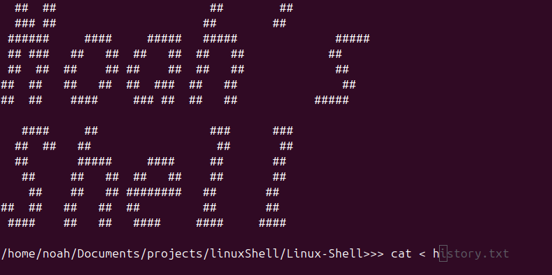
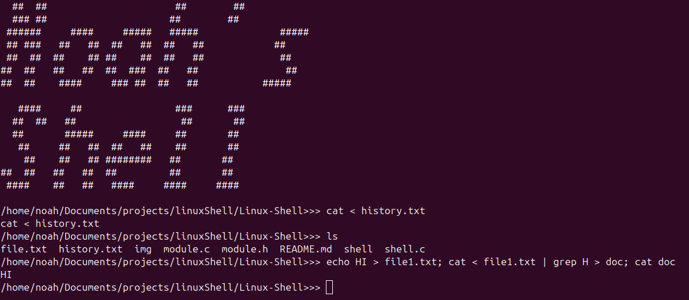

# Linux Shell Interface in C
This is a shell interface in C for linux systems (Ubuntu). This allows use of all normal commands, piping, redirection, and sequential commands. It also includes prediction and auto-completion, of tasks as well as the ability to reuse old commands with the up and down arrows.
## Usage
Before Compilation - Change the HISTORY_FILE value to an existing location on your system.
To compile
```
gcc shell.c module.c -o shell
```
To run
```
./shell
```
## Example


